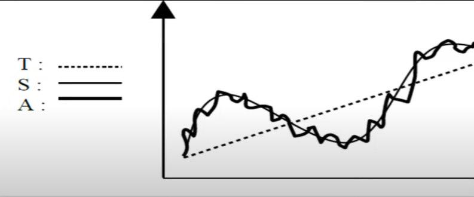
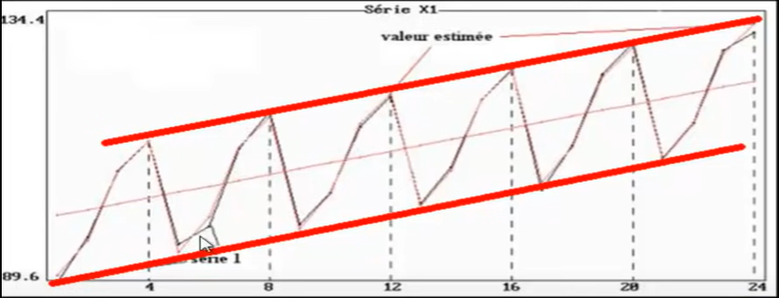
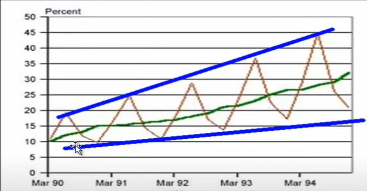
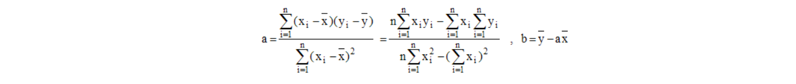

## Auteur: Laby Damaro CAMARA

## Email: ldamaro98@gmail.com

## Github: https://github.com/camara94

# Séries Temporaires

## Definition d'une serie chronologique
Ensemble d'observation d'une variable statistique économique faite
à intervalles reguliers de temps(Années, Trimestres, mois, semaines, jours, ...)

## Composantes d'un serie
* **Trend(Tendance) :** c'est une composante observée sur une longue période.
* **Composante Saisonnière :** c'est un phènomène qui se répète à intervalles de temps réguliers(périodiques)
* **Composante Accidentelle :** c'est un phénomène qui se produit très rarement(grève, condition météorologique, ...)
* **Composante residuelle :** c'est un phènomène due à des fluctuations irrégulières, en général(aléatoire), on parle aussi d'aléas.

## Type de modèle

* modèle additif Y = T + S + R
* modèle multiplicatif Y = T * S * R

## Comment savoir le type de modèle

* **Le modèle additif** correspond au cas d'un movement saisonnier d'amplitude constante dans le temps.
  

* **Le modèle multiplicatif** correspond au cas d'un mouvement saisonnier d'amplitude croissante ou decroissante dans le temps.

## Calcule de l'équation de la droite
La droite de régression de y en x, également appelée 1ère droite de régression d'équation, y = ax + b peut être obtenu par le programme (système 2x2). Le coefficient directeur a et l'ordonnée à l'origine b correspondent à :

## Les valeurs du trend 
ce sont les y observés sur les yi calculés
* Modèle Multiplicatif
coeficient saisonnier = y/yi
* Modèle Additionnelle 
  coeficient saisonnier = y - yi